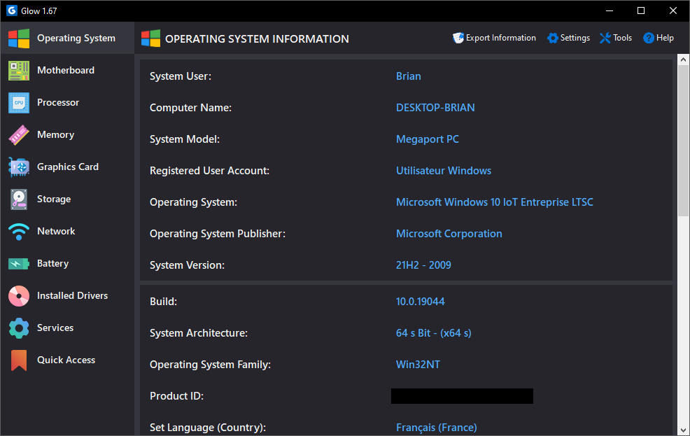

# Glow - System Analysis Software

**Glow** is a **system analysis software** developed by **Eray Türkay**. It allows you to show the hardware and software features of your computer in an easy way. Programmed only with **C# and .NET Framework**. And it's **completely free**!

# Download Glow

Download: [Glow Latest Version](https://github.com/LeBazarDeBryan/glow-old/releases/latest)

# Supported Languages

- Chinese
- English
- French
- German
- Greek
- Hindi
- Hungarian
- Indonesian
- Italian
- Japanese
- Korean
- Polish
- Portuguese
- Russian
- Spanish
- Swedish
- Turkish
- Ukrainian

# Supported Themes

- Light Theme
- Dark Theme

# Supported Operating Systems

- Windows 11 x64
- Windows 10 x64

# Supported Architectures

- 64 Bit (x64)
- 86 Bit (x86)
- ARM64 (ARM CPU)

# System Requirements

|  | Minimum Requirements | Recommended Requirements |
| -- | :--: | :--: |
| OS: | Windows 10 20H2 x64 | Windows 10 22H2 x64|
| CPU: | 1 Core, 2 GHz Processor Speed | 2 Cores, 3 GHz Processor Speed |
| RAM: | 35 MB Free RAM | 50 MB Free RAM |
| GPU: | DirectX 9 Support| DirectX 10.1 Support|
| STORAGE: | 10 MB Free Space | 20 MB Free Space |
| DISPLAY: | 1280x720 Resolution| 1600x900 Resolution|
| .NET: | .NET Framework 4.8.1 | .NET Framework 4.8.1 |
